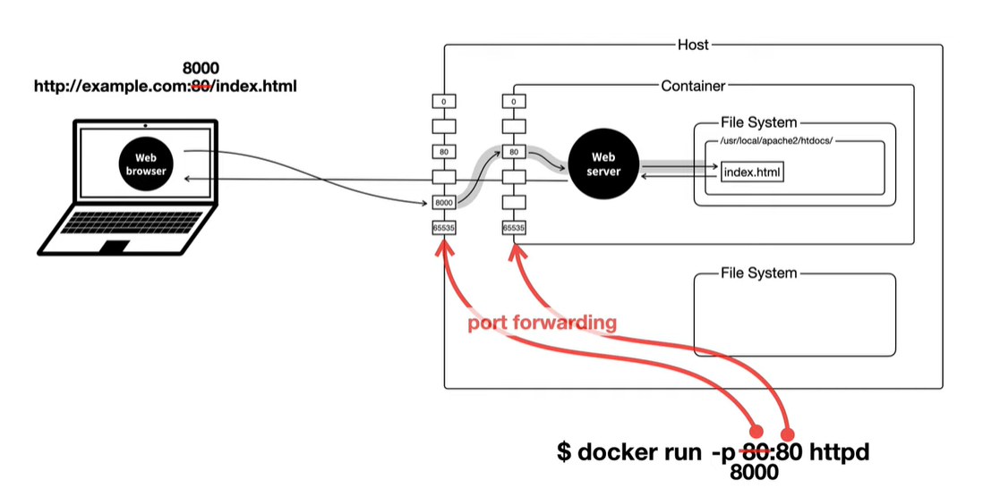

# Docker
도커는 리눅스 운영체제의 기술이다.  
도커 위에서 돌아가는 컨테이너, 그리고 컨테이너 안에서 돌아가는 각각의 앱들은 리눅스에서 돌아가는 앱들이다.  
리눅스가 아닌 경우, 가상머신을 통해 리눅스를 설치할 수 있다.  
그런데 이 과정이 까다롭기 때문에 도커가 자동으로 가상머신을 만들어주고 그 위에 리눅스를 설치해준다.  
가상머신을 만들어가면서 도커를 사용하는 이유는 도커가 주는 편리성이 어마무시하기 때문이다.  

## 용어
app store와 비슷하게 docker hub에서 필요한 sw를 다운받게 된다.  
program과 비슷하게 docker hub에서 다운 받은 것을 image라고 부른다.  
process와 비슷하게 image를 실제로 실행하는 것을 container라고 부른다.  
프로그램이 여러개의 프로세스를 가질 수 있는 것 처럼 이미지도 여러개의 컨테이너를 가질 수 있다.  

도커허브에서 이미지를 다운받는 것을 **pull**이라고 한다.  
이미지를 실행시키는 행위는 **run**이라고 한다.

## pull
`docker pull image_name` 을 사용하면 registry로 부터 이미지를 다운받을 수 있다.  
ex) `docker pull httpd`

`docker images`를 사용하면 설치된 이미지들을 볼 수 있다.

## run
`docker run image_name`를 사용하면 이미지를 기반으로 컨테이너가 생성된다.  
`docker ps`라는 명령어를 사용하면 컨테이너에 대한 정보를 볼 수 있다.  

`docker run [--name container_name] image_name`을 사용해서 컨테이너를 생성할 수도 있다.  
ex) `docker run --name ws1 httpd`를 하면 ws1이라는 이름을 가진 httpd 기반의 컨테이너가 생성된다.  

`docker stop container_name`을 이용해 종료시킬 수 있다.  
`docker logs container_name`을 이용해 로그를 볼 수 있다.  
`docker rm container_name`을 이용해 컨테이너를 지울 수 있다.
현재 실행 중인 컨테이너는 삭제할 수 없으므로 stop을 하고 삭제해야한다.  
`docker rmi image_name`을 이용해 이미지를 삭제할 수 있다.  

## Network
도커를 이용하면 웹서버가 컨테이너에 설치된다.
이 컨테이너가 설치된 운영체제를 Host라고 한다.  

  

`docker run -p 8000:80 httpd` 를 사용하면 호스트의 8000번 포트와 컨테이너의 80번 포트가 연결된다.  
-p는 publish의 줄임말이다. 위의 경우 localhost:8000으로 접속해야한다.   
이 과정을 port forwarding 이라고 한다.  

## 명령어 실행
`docker exec container_name COMMAND` 를 사용할 수 있다.  
`docker exec ws1 pwd`는 ws1이라는 컨테이너 안에서 pwd를 실행한 것과 같다.  

`docker exec -it container_name /bin/sh`을 통해 shell을 실행시킬 수 있다.  
컨테이너와 연결을 유지하면서 지속적으로 명령어를 실행하고 싶을 때 이용한다.  
사용자가 입력한 명령어를 shell이 받아서 os에게 전달해주는 것이다.  

-i는 interactive, -t는 tty의 약자이다.  
gui환경에서 cli를 눌렀을 때와 같은 효과이다.  

`exit`를 하면 컨테이너에서 나올 수 있다.  
sh는 기능이 부족하므로 /bin/bash를 히용해 bash shell을 사용해도 된다.  
하지만 bash shell이 없을 수도 있으므로 이 경우에는 sh를 사용하면 된다.  
컨테이너에는 nano, vim 에디터가 기본적으로 없다.  
`apt update` `apt install nano` 를 이용하면 nano를 설치할 수 있다.  

## 참고자료
https://www.youtube.com/playlist?list=PLuHgQVnccGMDeMJsGq2O-55Ymtx0IdKWf