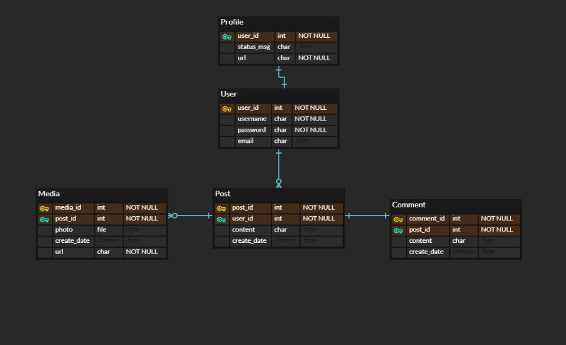
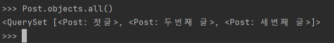

# 2주차 : Docker
도커는 리눅스 운영체제의 기술이다.  
도커 위에서 돌아가는 컨테이너, 그리고 컨테이너 안에서 돌아가는 각각의 앱들은 리눅스에서 돌아가는 앱들이다.  
리눅스가 아닌 경우, 가상머신을 통해 리눅스를 설치할 수 있다.  
그런데 이 과정이 까다롭기 때문에 도커가 자동으로 가상머신을 만들어주고 그 위에 리눅스를 설치해준다.  
가상머신을 만들어가면서 도커를 사용하는 이유는 도커가 주는 편리성이 어마무시하기 때문이다.  

## 용어
app store와 비슷하게 docker hub에서 필요한 sw를 다운받게 된다.  
program과 비슷하게 docker hub에서 다운 받은 것을 image라고 부른다.  
process와 비슷하게 image를 실제로 실행하는 것을 container라고 부른다.  
프로그램이 여러개의 프로세스를 가질 수 있는 것 처럼 이미지도 여러개의 컨테이너를 가질 수 있다.  

도커허브에서 이미지를 다운받는 것을 **pull**이라고 한다.  
이미지를 실행시키는 행위는 **run**이라고 한다.

## pull
`docker pull image_name` 을 사용하면 registry로 부터 이미지를 다운받을 수 있다.  
ex) `docker pull httpd`

`docker images`를 사용하면 설치된 이미지들을 볼 수 있다.

## run
`docker run image_name`를 사용하면 이미지를 기반으로 컨테이너가 생성된다.  
`docker ps`라는 명령어를 사용하면 컨테이너에 대한 정보를 볼 수 있다.  

`docker run [--name container_name] image_name`을 사용해서 컨테이너를 생성할 수도 있다.  
ex) `docker run --name ws1 httpd`를 하면 ws1이라는 이름을 가진 httpd 기반의 컨테이너가 생성된다.  

`docker stop container_name`을 이용해 종료시킬 수 있다.  
`docker logs container_name`을 이용해 로그를 볼 수 있다.  
`docker rm container_name`을 이용해 컨테이너를 지울 수 있다.
현재 실행 중인 컨테이너는 삭제할 수 없으므로 stop을 하고 삭제해야한다.  
`docker rmi image_name`을 이용해 이미지를 삭제할 수 있다.  

## Network
도커를 이용하면 웹서버가 컨테이너에 설치된다.
이 컨테이너가 설치된 운영체제를 Host라고 한다.  

  

`docker run -p 8000:80 httpd` 를 사용하면 호스트의 8000번 포트와 컨테이너의 80번 포트가 연결된다.  
-p는 publish의 줄임말이다. 위의 경우 localhost:8000으로 접속해야한다.   
이 과정을 port forwarding 이라고 한다.  

## 명령어 실행
`docker exec container_name COMMAND` 를 사용할 수 있다.  
`docker exec ws1 pwd`는 ws1이라는 컨테이너 안에서 pwd를 실행한 것과 같다.  

`docker exec -it container_name /bin/sh`을 통해 shell을 실행시킬 수 있다.  
컨테이너와 연결을 유지하면서 지속적으로 명령어를 실행하고 싶을 때 이용한다.  
사용자가 입력한 명령어를 shell이 받아서 os에게 전달해주는 것이다.  

-i는 interactive, -t는 tty의 약자이다.  
gui환경에서 cli를 눌렀을 때와 같은 효과이다.  

`exit`를 하면 컨테이너에서 나올 수 있다.  
sh는 기능이 부족하므로 /bin/bash를 히용해 bash shell을 사용해도 된다.  
하지만 bash shell이 없을 수도 있으므로 이 경우에는 sh를 사용하면 된다.  
컨테이너에는 nano, vim 에디터가 기본적으로 없다.  
`apt update` `apt install nano` 를 이용하면 nano를 설치할 수 있다.  

## 참고자료
https://www.youtube.com/playlist?list=PLuHgQVnccGMDeMJsGq2O-55Ymtx0IdKWf


# 3주차 : 모델링과 Django ORM
- null=True와 blank=True
    - 둘 다 default 값은 False
    - null=True는 DB 필드 값이 NULL로 저장 (NULL)
    - blank=True는 필드가 폼에서 빈 채로 저장 (빈 문자열 '')
    - CharField와 TextField는 예외. 아무 값을 입력하지 않으면 빈문자열('')값로 저장


- Foreignkey
    - 1:N 관계
    - N인 쪽에서 관계 선언


- Migration
    - `python manage.py makemigrations <app-name>` 을 통해 마이그레이션 파일을 만든다.
    - `python manage.py migrate <app-name>`을 통해 마이그레이션 파일을 DB 스키마에 반영한다.


- Django ORM
    - Object Relation Mapping, 객체지향 언어와 RDBMS 시스템을 매핑
    - 객체지향 프로그래밍을 쉽게 하도록 도움
    - SQL문 사용하지 않고 DB 접근 가능
    - ORM 쿼리를 이용하자!
        - model_name.objects.all() 등이 ORM 쿼리이다.


## 모델링  
- 인스타그램 서비스
  1. 사용자는 각자의 프로필에 이름, 이메일, 상태메세지를 저장할 수 있다.
  2. 사용자는 게시물을 CRUD 할 수 있다. 이때 사진, 영상, 내용글이 함께 create 된다.
  3. 사용자는 모든 게시물에 댓글을 달 수 있다.
  4. 사용자는 모든 게시물과 댓글에 좋아요를 누를 수 있다.


- Profile
  - 기본 User 모델에서 제공해주는 username, password, email 등을 그대로 사용하고,  
  Profile 모델에는 상태메세지를 의미하는 status_msg를 추가했다.
- Post
    - 게시물을 관리하는 모델  
    한 사용자가 여러 게시물을 작성할 수 있으므로 user와 일대다 관계이다.  
    게시물 고유 id가 존재하며, 내용을 쓸 수 있는 content, 생성일자를 나타내는 create_date가 있다.  
    어떤 사용자가 작성한 Post인지 식별하기 위해 user 모델을 foreignkey로 두었다.
- Comment
    - 댓글을 관리하는 모델  
    한 게시물에 여러 댓글이 생성될 수 있으므로 post와 일대다 관계이다.  
    댓글별 고유 id가 존재하며, 댓글 내용을 쓸 수 있는 content, 생성일자를 나타내는 create_date가 있다.      
- Media
    - 사진, 영상을 업로드 하기 위한 모델  
    한 게시물에 여러 파일이 업로드 될 수 있으므로 post와 일대다 관계이다.  
    어떤 게시물에 해당되는 파일인지 구별하기 위해 post 모델을 foreignkey로 두었다.



- 추가 : ImageField를 사용하려면 `pip install Pillow` 필수
  - 하지만 pillow 때문에 도커 빌드가 계속 실패했다 -> uninstall pillow 하니 정상적으로 빌드 됨
  - 구글링 결과 pip 버전 문제.. 라던데 더 알아봐야 할 것 같다.


- 장고 Shell 시작하기
    - `python manage.py shell`을 사용하여 shell 시작
    - `from api.models import User, Profile, Like, Post`를 사용하여 Post 모델 불러오기
    - `from django.utils import timezone`를 사용하여 현재시간을 부르기
    - `l = Like(like_cnt=0)` `l.save()` 좋아요 모델 데이터
    - `u = User(username="홍길동")` `u.save()` 유저 모델 데이터
    - `pro = Profile(user=u)` `pro.save()` 프로필 모델 데이터
    - `p = Post(user=u, like=l, content="첫글", create_date=timezone.now())` `p.save()` 포스트 모델 데이터
    - 위의 과정을 모두 마치면 홍길동이 "첫글"이라고 올린 게시글이 업로드 되는 것이다.
    - ORM을 사용하여 `Post.objects.all()`을 하면 글의 정보를 알 수 있다.
  

앞에서 데이터를 하나 삭제(p.delete() 이용)했어서 id가 2부터 시작한다   
이렇게 하면 id 2번인 데이터가 뭔지 알 수 없어서  
models.py에 다음과 같은 코드를 추가했다   

```
def __str__(self):   
  return self.content  
```

  - 결과는 아래와 같다. content로 게시물을 구별할 수 있다.    
  


- `Post.objects.filter(id=3)` 을 이용하면 id 3인 글만 불러올 수 있다.  


- 추가 : DateField(auto_now_add=True)를 추가했다.  
field option에서, auto_now=True 는 주로 수정일자에 사용된다.  
model 이 save 될 때마다 현재날짜로 갱신된다.  
field option에서, auto_now_add=True 는 주로 생성일자에 사용된다.  
model 이 최초 저장될 때만 현재날짜가 적용된다.

# 4주차 : DRF1 - Serializer
## 개념
### JSON과 REST API 
객체 표기법은 언어마다 다른데, JSON은 **특정 언어에 종속되지 않은 채로** 데이터를 교환하기 위해 만들어진 데이터 포맷이다.  
데이터를 표시하는 표현 방법이라고 생각하면 된다.  

Django는 보통 views.py에서 return을 할 때, render나 httpresponse함수를 사용하여 렌더링된 html페이지를 돌려준다.  
즉 프론트 개발자들의 장고 template를 작성해야하는 것이다.  
장고를 모르는 프론트 개발자들은 어떻게 하란 말인가!  

일단, REST API라는 것을 사용하면  
GET, POST, PUT, DELETE 같은 http method와 (CRUD기능), http url을 사용해서 특정 정보를 주거나 받는 행위를 쉽게 할 수 있다.  
Django REST API를 사용하면, view에서 html페이지가 아닌 JSON형식의 정보를 전달해줄 수 있는 것이다.  
즉 프론트 개발자들은 장고를 몰라도 JSON 형식의 데이터를 가져와 작업을 할 수 있다!  
CEOS의 프론트 개발자들이 사용하는 리액트 뿐만 아니라 여러 도구에 제약이 없어지는 것이다.  

추가적으로 URI는 자원을 표현하는데 중점을 두어야 한다.  
그러므로 delete와 같은 행위에 대한 표현이 들어가면 안된다.  
그리고 가독성을 높이기 위해 밑줄(_)보다는 하이픈(-)을 사용한다.  

### DRF
DRF(Django Rest Framework)란, Django 안에서 RESTful API 서버를 쉽게 구축할 수 있도록 하는 오픈소스 라이브러리다.  
DRF는 Serializer 기능을 제공해준다. 또한 Serializer는 직렬화 라는 뜻을 가지고 있다.  
쉽게 이야기 하면, Python 데이터와 QuerySet 데이터를 JSON 타입의 데이터로 변환해주는 역할을 한다!  

### Serializer vs Form
Serializer를 찾아보니 기존에 사용해봤던 Django Form과 비슷했다.  
차이가 뭘까?  

Form, ModelForm은 HTML 입력폼을 통해 입력에 대한 유효성 검사를 수행한다.  
주로 Create, Update 등 admin에서 활동이 된다.  

Serializer, ModelSerializer는 데이터 변환과 직렬화를 지원하는 것이다.  
주로 JSON 포맷 입력에 대한 유효성을 검사한다.  

이제 장고를 이용해 RESTful한 API를 만들어보자!

## 적용
### DRF 세팅
현재 프로젝트를 기준으로 /django_rest_framework_15th/settings/base.py 안의 INSTALLED_APPS에  
`'rest_framework',`를 추가한다.  
이렇게 하면 DRF를 사용할 수 있다.  

### Serializer
ModelSerializer은 모델을 JSON으로 쉽게 바꿀 수 있도록 해준다.  
PostSerializer, CommentSerializer를 만들어서 내가 원하는 모델의 필드들만 json으로 만들어줄 수 있다.  
`fields = '__all__'`을 사용하면 모델의 모든 필드를 가져올 수도 있다.  

### Nested Serializer
두 모델이 연관이 있을 때 사용할 수 있는 것이다.  
이 프로젝트의 모델은 Post, Comment, Media가 연관 관계를 가지고 있으므로 Nested Serializer을 사용해보도록 하겠다!  

### Serializer Method Field
모델에 없는 필드이지만 JSON에 추가하고 싶거나  
모델에 있는 값을 변경해서 JSON에 추가하고 싶을 때 사용할 수 있다고 한다.  
(예를 들어 모델에는 fullName 필드가 있지만 JSON에는 firtsName으로 보내고 싶을 때)  

### API Test
`TypeError at /api/posts/
In order to allow non-dict objects to be serialized set the safe parameter to False.`  
라는 에러가 떴다.  
그래서 api/views.py 의 post_list의 리턴값을  
`return JsonResponse(serializer.data, safe=False)`  
로 바꾸었다. `safe=False`를 추가한 것!  
수정 후 127.0.0.1:8000/api/posts/로 접속 시  
  
위와 같이 뜬다.... 오류일까..?  

### 과제 1. 데이터 삽입
**모델 (Post, Comment)**  
  

**데이터**  
  
/admin 을 사용했다!

### 과제 2. 모든 데이터를 가져오는 API
- **URL**: `api/posts/`  
- **Method**: `GET`  
```
  [
    {
        "user": 1,
        "content": "첫글",
        "create_date": "2022-04-01"
    },
    {
        "user": 1,
        "content": "두번째 글",
        "create_date": "2022-04-01"
    },
    {
        "user": 1,
        "content": "세번째 글",
        "create_date": "2022-04-01"
    },
    {
        "user": 6,
        "content": "Test",
        "create_date": "2022-04-29"
    }
]
```

### 과제 3. 새로운 데이터를 create하도록 요청하는 API
- **URL**: `api/posts/`  
- **Method**: `POST`  
- **BODY**: `{"user":"6","content": "다섯번째 글", "create_date": "2022-04-29"}`
```
{
    "user": 6,
    "content": "다섯번째 글",
    "create_date": "2022-05-05"
}
```


- **URL**: `api/posts/`  
- **Method**: `POST`  
- **BODY**: `{"user":"6","content": "여섯번째 글"}`
```
{
    "user": 6,
    "content": "여섯번째 글",
    "create_date": "2022-05-05"
}
```

### 회고
Serializer를 처음 사용해보는 거라 많은 것을 배울 수 있었다.   
API 작성 완료 후 테스트를 하는 과정에서  
DRF+브라우저 활용 방법을 이용했는데 브라우저 화면이 원하는대로 띄워지지 않아서 오류가 생겼다고 생각된다..   
오류 수정을 최대한 해보고 만약 방법을 찾을 수 없으면  
포스트맨을 설치해서 5주차 스터디 전까지 리드미에 추가할 예정이다!!  

+) 포스트맨 설치를 후 API test를 성공적으로 할 수 있었다!!  
POST를 할 때 500 server가 났었는데 그 이유는 내가 api/posts/가 아닌 api/posts를 했기 때문이다.  
마지막에 슬래시를 꼭 쓰자.  

그리고 create_date같은 경우, 내가 임의로 과거의 시간으로 설정해도  
오늘 날짜로 자동으로 값이 전달되었다!  


