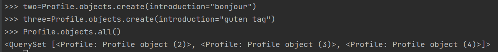
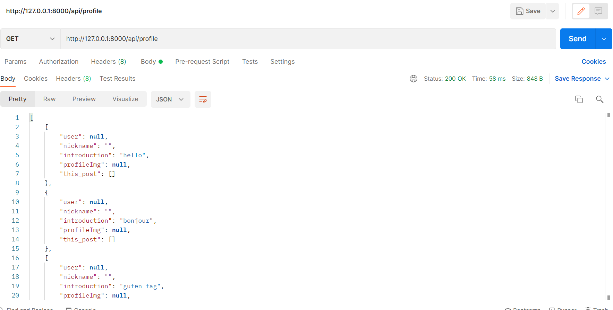
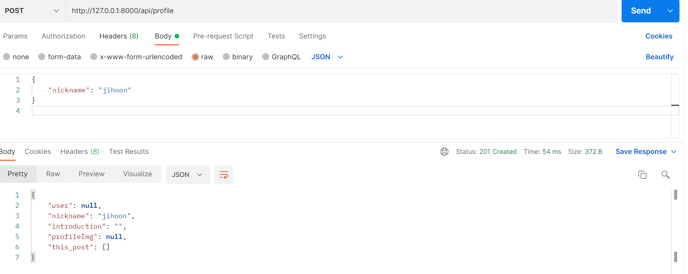

<html>
<head>
  <meta charset = "utf-8">
</head>
  <body>
    <h2><strong>2주차 과제 : Docker를 이용한 배포에 대해 공부하기</h2></strong>
    <ol>
      <li><h2><strong>what is docker?</strong></h2></li>
      
      

      <h4><strong>컨테이너 기반의 오픈소스 가상화 플랫폼</strong></h4>
      이 때, <strong>(1)컨테이너</strong>란 <strong>격리된 공간에서 프로세스가 동작하는 기술. 가상화 기술의 하나</strong>
      기존 가상화는 호스트 OS 위의 게스트 OS 전체를 가상화하는 방식(VMware or VirtualBox), 사용법이 간단하지만 무겁고 느림
      그 후 CPU의 HVM을 이용해 KVM(Kernal Virtual Machine)과 반가상화 방식의 Xen 등장, 그러나 이것도 결국 추가적인 os설치를 이용한 가상화로써 성능 하락
        
      이를 개선하기 위해 <strong>프로세스를 격리하는 방식</strong>이 등장, 이 방식을 리눅스에서 <strong>리눅스 컨테이너</strong> 라고 부름.
      (현재의 docker는 lxc(linux container)가 아닌  libcontainer라는 자체 컨테이너 사용함)
      단순히 프로세스를 격리함으로 가볍고 빠름. 성능적으로도 거의 손실 없음
      컨테이너 실행에 필요한 모든 파일과 설정값을 포함하는 파일이 <strong>이미지</strong>로 무상태성, 불변성을 가짐
      같은 이미지에서 여러개의 컨테이너 생성 가능, 컨테이너가 바뀌거나 삭제되어도 이미지는 변하지 않음.
      docker는 layer의 개념 사용. 유니온 파일 시스템을 이용하여 여러개의 레이어를 하나의 파일 시스템으로 사용할 수 있게 해줌.
       
      left: docker, right: VM
      
      

      <li><h2><strong>What is benefit and weakness of using docker</strong></h2></li>
    
<h4><strong>benefit</strong></h4><ul>
    <li><strong>구성 단순화</strong> - 하나의 Configuration으로 모든 플랫폼에서 실행할 수 있음. 하나의 docker 이미지를 다른 곳에서도 사용 가능</li>
    <li><strong>코드 관리</strong> - 일관된 환경 제공(docker 이미지의 불변성!)</li?
    <li><strong>개발 생산성 향상</strong> - 개발 환경과 운영 환경의 차이점 최소화. Vm에 비해 사용 자원이 적어 여러가지 서비스 실행 가능</li>
    <li><strong>애플리케이션 격리</strong></li>
    <li><strong>빠른 배포</strong></li>
      </ul>

  
<h4><strong>weaknesses of Docker</strong></h4>
  수많은 컨테이너와 컨테이너화 된 앱들의 관리 및 오케스트레이션(컴퓨터 시스템과 애플리케이션, 서비스의 자동화된 설정, 관리, 조정)이 어려워짐
  -> 컨테이너의 그룹화가 필요함 -> <strong><a href = "https://www.redhat.com/ko/topics/containers/what-is-kubernetes", title="kubernetes">쿠버네티스?</a></strong>
  <h2><li><strong>about 2nd seminar - docker & docker-compose, github action</strong></li></h2>
      <strong>Docker</strong> -> Dockerfile을 실행시켜줌, Dockerfile은 하나의 이미지를 만들기 위한 과정(이미지에 대해서는 위에서 이미 설명한 대로 !) 
      <strong>docker-compose</strong> -> docker-compose.yml을 실행시켜줌 , 이미지를 여러개 띄워서 서로 네트워크도 만들어주고 컨테이너의 밖의 호스트와도 어떻게 연결할지, 파일 시스템은 어떻게 공유할지(volumes) 제어해주는것이 docker-compose 
  <h4>github action이 해주는 일 - <strong>Workflow의 자동화</strong></h4>
  Workflow의 종류    
    <ul>
        <li>Test code</li>
        <li>배포 - 서버에 새로운 버전, 기능 등 배포</li>
        <li>자동화 하고싶은 스크립트</li>
      </ul> 
      
<strong>github action 사용 예시</strong> <a href="https://fe-developers.kakaoent.com/2022/220106-github-actions/",target="__blank", title="usage of github action">카카오웹툰의 깃허브 액션 사용예</a>

    
<h4><strong>이번 세미나에서 진행한 배포의 흐름</strong></h4>
    <ol>
    <li>Github Actions가 우리의 코드를 서버에 올리고 deploy.sh를 실행</li>
    <li>deploy.sh는 docker-compose를 실행</li>
    <li>docker-compose는 web이라는 컨테이너와 nginx라는 컨테이너를 빌드하고 실행</li>
    <li>web 컨테이너는 Dockerfile.prod를 기준으로 빌드</li>
    </ol>
    

    <li><h2><strong>소감</strong></h2></li>
    docker와 연동하여 배포하는 것에 대해 아예 몰랐던것은 아니지만 조금 공부가 부족했던 점이 있었는데, 이번 세미나와 과제를 통해 제대로 학습할 수 있음이 좋았습니다.
    리드미에서는 일단 가장 중요한 것 같은 Docker, docker-compose와 관련된 부분 중심으로 다루었고, 이를 넘어가지만 흥미있던 부분들에는 링크를 걸었습니다. 관심있으신 분들은 참고하시면 될 것 같습니다.
    항상 세미나를 통해 모르는것을 배워가는것이 매우 기분 좋고 보람찹니다. 진행해주시는 운영진 여러분들께 감사드리며,  앞으로도 CEOS 백엔드팀에서 저와 저희 백엔드 모두 함께 성장할 수 있었으면 좋겠습니다.
    </ol>
    <h1>3주차 과제</h1>
    <ol>
      <li><h3><strong>sql 연결</strong></h3></li>
      
     

    <li><h3><strong>인스타그램 모델링과 데이터 작성 </strong></h3></li>
    
      <ul>
          <li><strong>profile</strong> : 장고에서 제공하는 기본 user의  OneToOne Link 방식 확장</li>
          <li><strong>Post</strong> : 게시글. user와 1:N 관계. 내용과 생성 날짜</li>
          <li><strong>Comment</strong> : 댓글. 게시글과 1:N 관계</li>
          <li><strong>Media</strong> : 미디어. 게시글에 올라갈 이미지 혹은 영상에 관한 정보 </li>
          <li><strong>Like</strong> : 좋아요 기능 관련 .현재는 게시글에만 좋아요를 설정했으나..</li>
      </ul>
     

  <li><h3><strong>django ORM 쿼리</strong></h3></li>
    
     user 생성 후 user를 이용한 post 객체 생성. 그 후 filter를 이용해 post의 멤버들을 가지고 객체들을 조회함

  
  
  <li><h3><strong>소감과 느낀점</strong></h3></li>
 건강상의 문제로 인해 계속 늦어지고 계속 정상적인 과제 진행이 안되고 있었습니다. 급하게 하느라 부족한 점이 너무 많아 최대한 이른 시간내에
 수정 보완을 진행할 예정입니다. 
 건강 뿐 아니라 기본적인 프로젝트 진행에 있어서도 여러모로 애를 먹었습니다. 저의 부족함 때문입니다. 
 sql을 직접 다루는게 아닌 ORM으로 다루는것이 익숙치는 않았기에 공부중에 있습니다. 
 erd 설계 부분도 다른 분들의 리드미를 읽어보닌 너무 제가 간단하게 생각했다는걸 깨달았습니다.  
 수정과 보완이 많이 필요할 것 같다는 생각이 듭니다. 
 바쁘신 와중에 허접한 과제 보여드려 죄송합니다. 분발하겠습니다. 
 </ol>
 
 <h1><strong>4주차 과제 - drf1 : serializer</strong></h1>
 <ol>
  <h3><strong><li>저번 과제의 수정 사항들 반영 - 모델 수정 및 마이그레이션 진행</strong></li></h3>
  <h3><strong><li>데이터 삽입</li></strong></h3>
  
  
    class Profile(models.Model):
    user = models.OneToOneField(User,blank=True, null=True, on_delete=models.CASCADE)
    nickname = models.TextField(null=False, max_length=10)
    introduction = models.TextField(default='', max_length=200)
    profileImg = models.CharField(null=True, max_length=200)
    
  <h3><strong><li>모든 데이터를 가져오는 api 만들기 </li></strong></h3>
    api/profile GET
  
  
  <h3><strong><li>새로운 데이터를 create 하도록 요청하는 api</li></strong></h3>
    api/profile POST
  
  
  <h3><strong><li> 진행하면서 발생한 오류들 정리 </li></strong></h3>
  <ul>
  <li>1048 - Profile 모델이 foriegn key로 user를 가지는데, Profile 생성시 user가 주어지지 않아서 생긴 문제 - 생성시 save 전에 user를 줌으로써 해결</li>
      serializer.user = User
  <li>1054 - 마이그레이션 관련 오류 - 모델이 수정되면서 생긴 오류 -> 마이그레이션 파일 삭제 후 다시 makemigrations (이 때 number 파일들만 삭제</li>
  <li>1452 - a->b foreign key 참조, b->c foreign key 참조. 이 상황에서 a->c 참조로 인한 error. 해결법 - 마이그레이션을 다시 해줬음.
  <li> 마이그레이션 변경 - 원래 있던 데이터들에 대해 새로 생긴(수정된) 필드를 어떻게 적용할 것인지. null=True 혹은 default 값 설정</li>
  </ul>
   
   <h3><strong><li>소감</li></strong></h3>
발생한 수많은 에러들을 처리하느라 진땀흘린 과제였습니다. 개인적으로 3주차 과제에 부족한점이 많았고 그로 인한 수정사항들로 인해서 이번 과제에서 굉장히 많은 에러들을 뽑아낸것이 엄청나게 당황스러웠습니다. 또한 몇 몇 에러들은 ERD를 더 섬세하게 했다면 애초에 발생하지 않았을 과제인 것 같아서 아쉬웠습니다. 앞으로 백엔드 개발자로서 ERD와 모델링에 대해 좀 더 섬세히 공부하고 계획할 필요가 있다고 생각하였습니다. api test를 위해 post맨을 사용하였는데, 지금 보시다시피 error들을 회피하여 api test를 하기 위해 너무 많은 default값을 줬고 그로 인해 post 요청에 정말 저거 하나만 때려도 성공하는걸 보고 복잡한 감정이 들었습니다.. 앞으로 열심히 하겠습니다.  
</ol>  
 
      
 <h1><strong>5주차 과제 - drf2 : Api view</strong></h1>
  
 <ol>
  <li><h3><strong>저번 주차 과제의 피드백 사항 정리</strong></h3> 
     <ul>
       <li> user - profile, profile - post, user -post 사이의 참조 관계 중복 문제 개선</li>
       <li>url 설계 시 복수로 하는 사항 수정</li>
       <li>serilaizer의 기능에 관하여 -> 오직 직렬화만을 담당. 다른 방법으로의 에러 해결</li>
     </ul>
 </ol>
  </body>  
</html>
